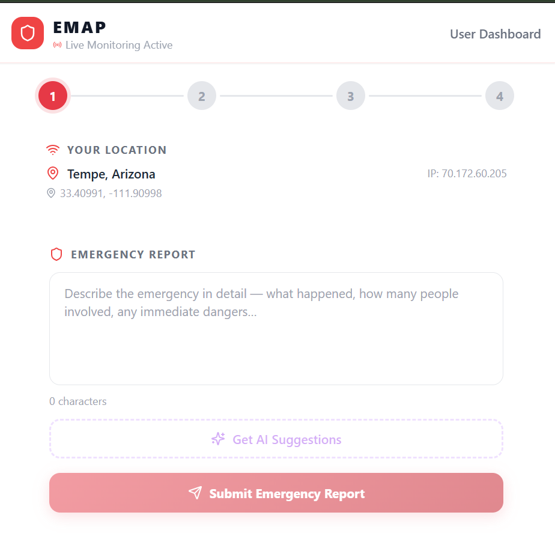
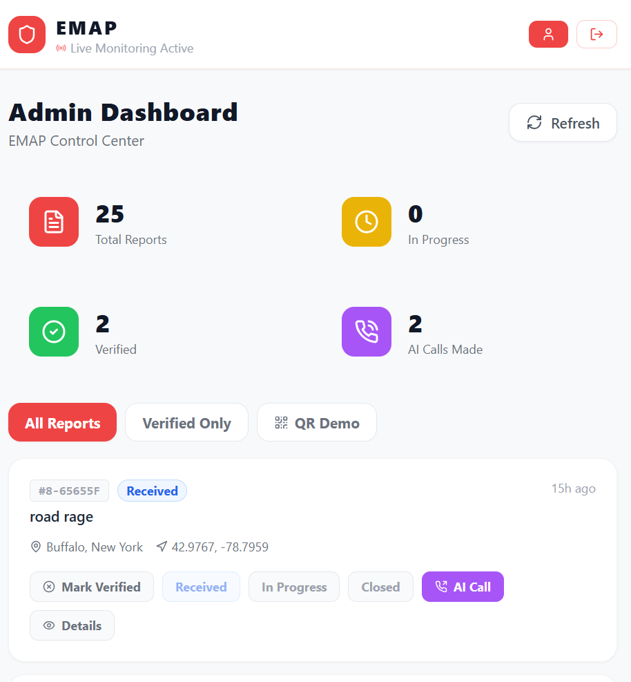

# Emergency Media Analyzer Platform

> **Capture. Report. Respond. Save Lives.**

EMAP is a full-stack emergency reporting platform that enables citizens to submit emergency reports with media evidence (video/audio), and administrators to manage, verify, and respond to incidents in real time.

🌐 **Live:** [emapnow.me](https://emapnow.me)

---

## ✨ Features

### 👤 Citizen Features
- 📍 **Auto location detection** — IP-based geolocation detects city, state, and coordinates automatically
- 📝 **Emergency report submission** — with description, location, anonymous or logged-in
- 🎥 **Media upload** — record video (back camera) or audio on mobile, or upload MP4/MP3/WAV files
- 🤖 **AI response suggestions** — Gemini 2.0 Flash suggests immediate response steps
- 🚨 **Live incident alert feed** — real-time feed from NWS, USGS, NIFC, TomTom + EMAP verified reports
- 📞 **Emergency contacts** — add 2 contacts with Call/SMS buttons
- 📱 **Mobile ready** — back camera, HTTPS, fully responsive

### 👮 Admin Features
- 🔐 **Admin login** — secret key registration
- 📊 **Admin dashboard** — all reports with full details, auto-refresh every 30 seconds
- ✅ **Verify reports** — mark incidents as verified
- 📊 **Status management** — Received → In Progress → Closed
- 📞 **AI Voice Call** — Twilio voice call to report submitter
- 📱 **Send SMS** — Twilio SMS to submitter + emergency contacts
- 🎥 **Media viewer** — view uploaded video/audio from S3
- 📱 **QR code** — scan to open emapnow.me

---

## 🏗️ Architecture

```
User/Mobile → emapnow.me (Route 53)
                    ↓
            AWS WAF (SQL injection, XSS, bot protection)
                    ↓
            AWS Amplify (React/Vite Frontend)
                    ↓ API calls
            api.emapnow.me (Route 53)
                    ↓
            ALB (Load Balancer - HTTPS/443)
                    ↓
            EC2 (Spring Boot - Port 8080)
                    ↓              ↓
            RDS MySQL          S3 Bucket
         (emap_db)          (emap-media-2026)
```

---

## ☁️ AWS Services (13)

| Service | Purpose | Real-World Analogy |
|---------|---------|-------------------|
| **EC2** | Spring Boot backend hosting | Office building |
| **RDS MySQL** | Database (reports, users, contacts) | Hospital records |
| **S3** | Video/audio media storage | Filing cabinet |
| **Amplify** | React frontend hosting + CI/CD | Digital storefront |
| **Route 53** | DNS management for emapnow.me | Street address |
| **ACM** | SSL/TLS certificate (HTTPS) | ID card |
| **ALB** | Load balancer, HTTP→HTTPS redirect | Receptionist |
| **IAM** | Roles & permissions | Security clearance |
| **CloudWatch** | Logs, alarms, dashboard | CCTV camera |
| **SNS** | SMS notifications | Megaphone |
| **WAF** | API protection (SQLi, XSS, bots) | Security bouncer |
| **CloudTrail** | Audit logging of all AWS actions | Security guard log |
| **Secrets Manager** | Secure credential storage | Bank vault |

---

## 🤖 Integrations

| Integration | Purpose |
|------------|---------|
| **Gemini 2.0 Flash** | AI emergency response suggestions |
| **Twilio** | Voice calls + SMS to reporters |
| **NWS API** | Live weather alerts |
| **USGS API** | Live earthquake data |
| **NIFC API** | Live wildfire data |
| **TomTom Traffic API** | Live accidents & road incidents |

---

## 🛠️ Tech Stack

### Frontend
- React + Vite
- Tailwind CSS
- AWS Amplify (deployment)

### Backend
- Spring Boot (Java 17)
- JWT Authentication + Spring Security
- AWS EC2 (t3.micro, Amazon Linux 2023)

### Database
- MySQL on AWS RDS (db.t3.micro)

### Security
- AWS WAF — OWASP Top 10 protection
- AWS Secrets Manager — zero hardcoded credentials
- AWS CloudTrail — complete audit logging
- IAM Roles — EC2 accesses S3/SNS via role, no access keys
- BCrypt password hashing
- HTTPS everywhere via ACM + ALB

---

## 🔐 Security Architecture

```
Internet
   ↓
AWS WAF (SQLi, XSS, Known Bad Inputs, IP Reputation)
   ↓
ALB + ACM (HTTPS/TLS termination)
   ↓
Spring Security + JWT (token-based auth)
   ↓
IAM Roles + Secrets Manager (zero hardcoded credentials)
   ↓
Protected Data (RDS + S3)
```

---

## 🗄️ Database Schema

### `users`
| Column | Type |
|--------|------|
| id | BIGINT PK |
| email | VARCHAR |
| password | VARCHAR (BCrypt) |
| name | VARCHAR |
| phone | VARCHAR |
| role | ENUM (user/admin) |
| created_at | TIMESTAMP |

### `reports`
| Column | Type |
|--------|------|
| id | BIGINT PK |
| incident_id | VARCHAR (INC-YYYYMMDD-XXXXXX) |
| description | TEXT |
| location, state | VARCHAR |
| latitude, longitude | DOUBLE |
| status | ENUM (Received/In Progress/Closed) |
| is_verified, is_anonymous | BOOLEAN |
| media_urls | TEXT (comma-separated S3 URLs) |
| ai_call_placed, ai_call_sid | BOOLEAN/VARCHAR |
| created_at, updated_at | TIMESTAMP |

### `emergency_contacts`
| Column | Type |
|--------|------|
| id | BIGINT PK |
| user_id | BIGINT FK |
| name, phone | VARCHAR |

---

## 🚀 Local Setup

### Prerequisites
- Java 17
- Maven
- MySQL
- Node.js + npm

### Backend Setup

```bash
# Clone the repo
git clone https://github.com/vgajavel-cyber/Emergency-Media-Analyzer-Platform.git
cd Emergency-Media-Analyzer-Platform/backend

# Create application.properties (see application.properties.example)
cp src/main/resources/application.properties.example src/main/resources/application.properties
# Fill in your local DB credentials and API keys

# Build and run
mvn clean package -DskipTests
java -jar target/backend-0.0.1-SNAPSHOT.jar
```

### Frontend Setup

```bash
cd frontend
npm install
npm run dev
```

---

## ⚙️ Environment Variables

See `backend/src/main/resources/application.properties.example` for required configuration.

All sensitive credentials (DB password, JWT secret, Gemini API key, Twilio credentials) are stored in **AWS Secrets Manager** in production.

---

## 🧪 Challenges & Solutions

| Challenge | Solution |
|-----------|----------|
| SMS carrier A2P 10DLC restrictions | Built full SNS infrastructure; pending carrier registration |
| Gemini API rate limits (429) | Caching strategy + Groq as fallback AI provider |
| Mixed content (HTTP/HTTPS) | ALB + ACM SSL certificate end-to-end |
| Location detection from server IP | Proxied ip-api.com through Spring Boot backend |
| Mobile back camera | `facingMode: environment` constraint |
| Linux case sensitivity on Amplify | Renamed `DangerzoneList.jsx` → `DangerZoneList.jsx` |

---

## 🔮 Future Enhancements

1. SMS A2P 10DLC carrier registration for real SMS delivery
2. Real-time emergency vehicle tracking map
3. VPC private subnet for RDS (database not internet-accessible)
4. Amazon Connect for AI-powered voice calls at scale
5. Automatic credential rotation via Secrets Manager
6. Real 911 / PulsePoint API integration
7. WAF logging to CloudWatch for threat analytics

---

## 📸 Screenshots

> *Add screenshots of your app here*

| Citizen Report Flow | Admin Dashboard |
|---|---|
|  |  |

---

## 👩‍💻 Author

**Praveena Gajavelli**
MS Information Technology — Arizona State University (GPA: 4.0/4.0)


[](https://linkedin.com/in/your-profile)
[](https://emapnow.me)

---

## 📄 License

This project is for academic and portfolio purposes.
